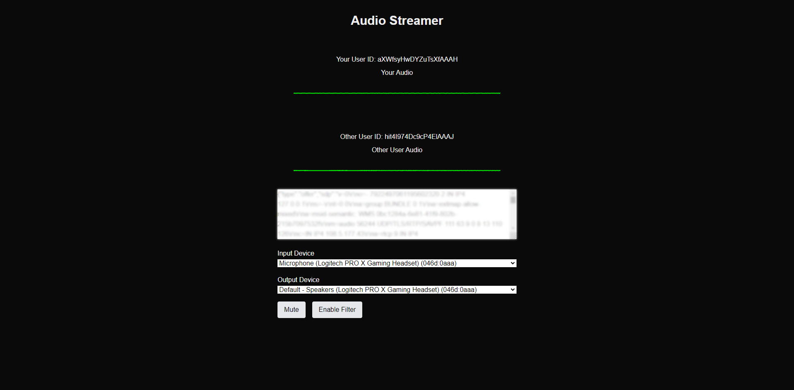

# Audio Streamer

This web application is a simple audio streaming feature between two users.



## Features

- Set audio input and outputs
- Filter toggle ability (0.75 gain, 0-200 HZ frequency range)
- Audio stream visualized as frequency spectrum.

## Technology Stack

- React.js
- Next.js
- Tailwind CSSS
- TypeScript
- Simple-peer
- Socket.IO

## Installation

To run the Audio Streamer application locally, follow these steps:

1. Clone the repository:

```bash
git clone https://github.com/yourusername/audio-streamer.git
cd audio-streamer
```

2. Install the required dependencies:

```bash
npm install
```

3. Run the node server:

```bash
npm run dev
```

4. Run the deployment server:

```bash
npm run dev
```
